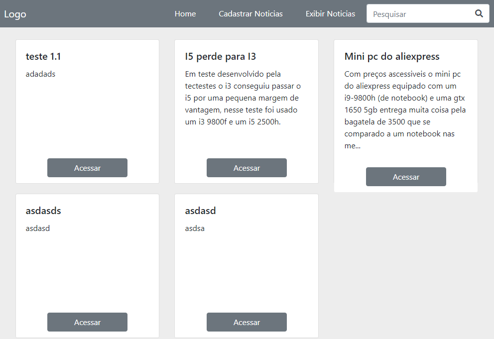

<h1 align="center">
  💻 Desafio Devmedia
</h1>

<h4 align="center">
  Projeto criado relacionado ao desafio postado no canal
  Devmedia.
</h4>

## 📚 Seções
O site é composto por 3 seções diferentes:

- **Home:** Nele temos uma breve apresentação das notícias e por podendo acessar-las;
- **Cadastrar notícias:** Nessa seção temos o cadastro das notícias;
- **Exibir notícias:** Apresenta uma tela que nela podemos tanto editar quanto deletar as notícias;

---

## 🔗 Tecnologias
Para o desenvolvimento deste site utilizei as seguintes tecnologias:

- HTML;
- CSS;
- PHP;

---

## 🙍‍♂️ Autor 
<table>
  <tr>
    <td align="center">
      <a href="https://github.com/cassiologon">
         
        
          <b>Cássio Maia</b>
        
      </a>
    </td>
  </tr>
</table>
